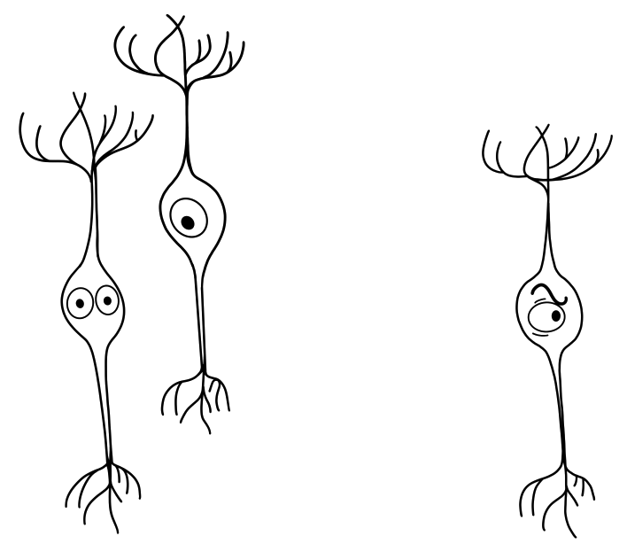

# Basic integration

## What's covered
This guide shows you how to let users link their BrightIDs to your app so you can check their verification status.

Other options for integrating BrightID not covered include
* Verifying community members through the [Discord unique bot](https://github.com/ShenaniganDApp/brightid-discord-bot).
* Tightly integrating BrightID connection-making into your app using [API functions](../../node-api) so users don't have to download the BrightID app separately.

## Prerequisites
This guide assumes you have a registered app and context; if not, please [contact a BrightID node operator](https://dev.brightid.org/#step-1).

## Creating links
### Create a unique identifer (`contextId`)
Each user of your app will need a unique identifier to serve as a `contextId`. This could be a UUID or any other url-escaped string.
### Format the universal link
The link is of the form
```
https://app.brightid.org/link-verification/{node_url}/{context}/{context_id}
```
where
* `{node_url}` is `http:%2f%2fnode.brightid.org` (url-escaping the slashes is necessary).
* `{context}` is the context registered for your app with node operators.
* `{contextId}` is the [unique identifier](#create-a-unique-identifier) you want to use to identify this user.

